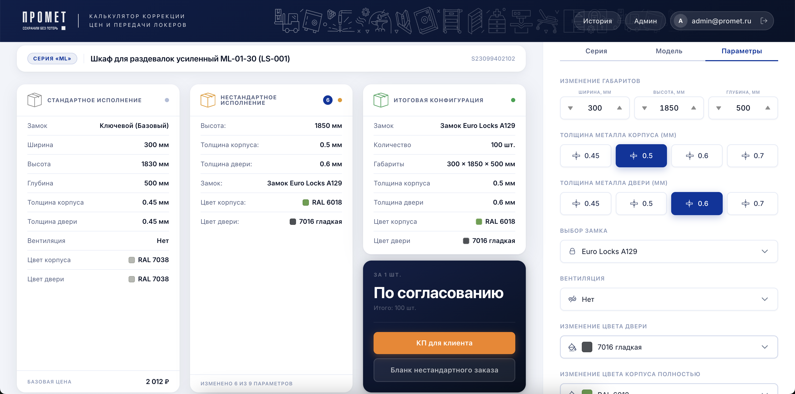

# Промет — Конфигуратор металлических шкафов



Веб-приложение для подбора, расчёта стоимости и оформления заявок на металлические шкафы серий **ML** и **LS**. Разработано в качестве внутреннего инструмента отдела продаж ООО «НПО Промет».

---

## Возможности

### Конфигуратор
- Выбор серии и модели из динамического каталога (Firebase)
- Настройка толщины металла корпуса и двери (0.5 / 0.6 / 0.7 мм)
- Изменение габаритов: ширина, высота, глубина
- Выбор типа замка с автоматической доплатой за секцию
- Включение / отключение вентиляции
- Выбор цвета корпуса и двери из каталога RAL
- Отображение дельты изменений относительно стандартной конфигурации
- Расчёт итоговой цены, веса и срока изготовления в реальном времени

### Генерация документов
- **Коммерческое предложение (КП)** — PDF на фирменном бланке с фотографией модели и параметрами, с наценкой по рентабельности
- **Наряд-заказ (НЗ)** — PDF-бланк с производственными параметрами без наценки
- Поддержка нестандартных моделей (ML-1, ML-2) с независимыми координатами полей

### Пользователи и доступ
- Firebase Authentication (регистрация, вход, выход)
- Ролевая модель: `admin` / `user`
- Мгновенная блокировка активной сессии при деактивации пользователя администратором

### Админ-панель
- Управление пользователями: просмотр, блокировка/разблокировка, смена роли
- Редактирование коэффициентов наценки (глубина, высота, толщина, вентиляция, цвет) в реальном времени через Firebase
- Drag-and-drop сортировка каталога

### История заказов
- Персональная история конфигураций с возможностью возврата к любой записи

---

## Стек технологий

| Инструмент | Версия | Назначение |
|---|---|---|
| React | 19 | UI-фреймворк |
| Vite | 8 | Сборщик и dev-сервер |
| Firebase | 12 | Auth, Firestore (база данных и каталог) |
| React Router | 7 | Клиентская маршрутизация |
| motion / Framer Motion | 12 | Анимации (AnimatePresence, spring) |
| pdf-lib + fontkit | 1.17 | Генерация PDF поверх готовых шаблонов |
| docx | 9 | Генерация DOCX |
| react-hook-form | 7 | Управление формами |
| @dnd-kit | 6/10 | Drag-and-drop в каталоге |
| sonner | 2 | Toast-уведомления |
| vitest | 2 | Unit-тесты |
| @testing-library/react | 16 | Компонентные тесты |
| Playwright | 1.60 | E2E-тесты |
| ESLint | 9 | Статический анализ |
| knip | 6 | Обнаружение неиспользуемого кода |

CSS-компоненты написаны с нуля через CSS Modules и Custom Properties — сторонних UI-библиотек нет.

---

## Архитектура

Проект построен по модульной архитектуре с явным разграничением слоёв:

```
src/
├── pages/              # Страницы-роуты (ConfiguratorPage, AdminPage, HistoryPage)
├── modules/            # Функциональные модули (Configurator, Parameters, Auth)
├── shared/
│   ├── api/            # Работа с Firestore (loadCatalog и др.)
│   ├── components/     # Переиспользуемые компоненты (AuthModal, Header, Footer…)
│   ├── constants/      # Глобальные константы
│   ├── context/        # React Context (AppContext)
│   ├── hooks/          # Кастомные хуки (useCatalog, useHistory, useConfig…)
│   ├── lib/            # Инициализация Firebase
│   └── utils/          # Утилиты (calcPrice, calcDiff, colors, cx…)
└── pdf/
    ├── kp/             # Генерация PDF коммерческого предложения
    └── nz/             # Генерация PDF наряда-заказа
```

**Поток данных:** каталог загружается из Firestore и кешируется в `localStorage` на 24 часа. Конфигурация хранится локально в состоянии, расчёт цены производится синхронно в `calcPrice.js` без обращения к серверу.

---

## Расчёт цены

Стоимость вычисляется как:

```
clientPrice = basePrice × (1 + Σ surchargeRates) + lockSurcharge
```

Доплаты рассчитываются с учётом объёма заказа (от 1 до 100+ штук) по таблицам коэффициентов из Firebase. При изменении ширины или более двух параметров одновременно цена требует ручного расчёта — система сигнализирует менеджеру.

---

## Запуск локально

```bash
# Установить зависимости
npm install

# Запустить dev-сервер
npm run dev

# Собрать для production
npm run build

# Запустить unit-тесты
npm test

# Запустить линтер
npm run lint
```

Для работы приложения требуется файл `.env` с реквизитами Firebase-проекта:

```
VITE_FIREBASE_API_KEY=...
VITE_FIREBASE_AUTH_DOMAIN=...
VITE_FIREBASE_PROJECT_ID=...
VITE_FIREBASE_STORAGE_BUCKET=...
VITE_FIREBASE_MESSAGING_SENDER_ID=...
VITE_FIREBASE_APP_ID=...
```

---

## Деплой

Проект размещается на **Firebase Hosting**:

```bash
firebase deploy
```

---

## Статус

Проект выпущен в релиз и используется в работе отдела продаж.

- [x] Конфигуратор шкафов ML / LS
- [x] Автоматический расчёт цены, веса и сроков
- [x] Firebase Auth и ролевая модель
- [x] Генерация КП (PDF) и НЗ (PDF)
- [x] Админ-панель: пользователи и коэффициенты
- [x] История заказов
- [x] Полная адаптивность (от 375 px)
- [x] Анимации (AnimatePresence, spring)
- [x] Unit-тесты и E2E-тесты

---

## Лицензия

© 1991–2026 ООО «НПО Промет». Внутренняя разработка, не предназначена для публичного распространения.

<!-- Pull Shark 1 -->
